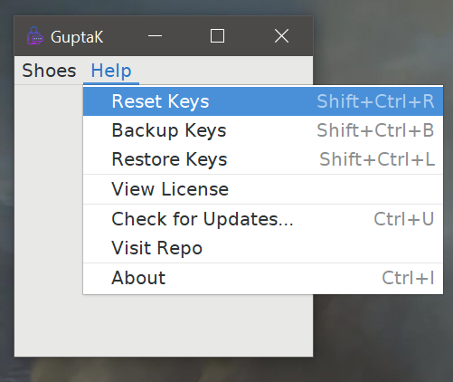
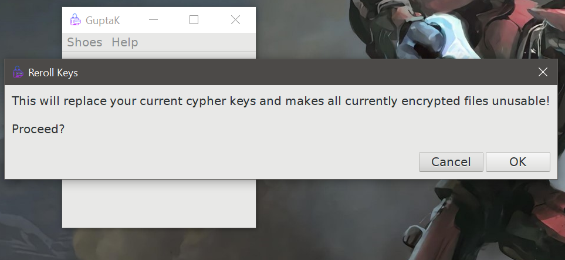
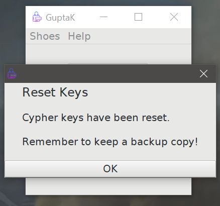

[](https://github.com/JDsnyke/GuptaK/subscription) [](https://github.com/JDsnyke/GuptaK/stargazers) [](https://github.com/JDsnyke/GuptaK/fork)

Derived from the Sinhalese word Guptakētanaya, GuptaK aims to provide a simple solution for message obfuscation.

   

 


## Getting Started

These instructions will get you a copy of the project up and running on your local machine for development and testing purposes.

## Installation

### Windows

* Download the latest [release](https://www.github.com/JDsnyke/GuptaK/releases/latest) .exe file.

* Run the exe file and install GuptaK.

* Launch program!

```x64 only! Use the .shy for x32 systems!```

### Mac OS

* Download the latest version of [Shoes 3](http://walkabout.mvmanila.com/downloads/).

* Download the latest [release](https://www.github.com/JDsnyke/GuptaK/releases/latest) .shy file for OSX.

* Launch the .shy using Shoes 3.

### Linux

* Download the latest version of [Shoes 3](http://walkabout.mvmanila.com/downloads/).

* Download the latest [release](https://www.github.com/JDsnyke/GuptaK/releases/latest) .shy file for Linux. 

* Launch the .shy using Shoes 3.

## First Time Instructions

1. Click 'Reset Keys' under the 'Help' menu.



2. Click 'Ok' to proceed.



3. Your 'Crypt Keys' have been reset!



## Screenshots

> WIP

## Built With

* [Ruby](https://www.ruby-lang.org/en/) - A dynamic, open source programming language with a focus on simplicity and productivity.

* [Shoes 3](https://github.com/shoes/shoes3) - A tiny graphical app kit for Ruby.

## Contributing

Please read [CONTRIBUTING.md](CONTRIBUTING.md) for details on our code of conduct, and the process for submitting pull requests to us.

## Versioning

We use [SemVer](https://semver.org/) for versioning. For the available versions, view the [tags on this repository](https://github.com/JDsnuke/GuptaK/tags).

## Authors

* **Janith Dissanayake** - Initial work - [JDsnyke](https://github.com/JDsnyke).

* **Thrisen Punithan** - Code Review and Optimize - [Thrisen97](https://github.com/Thrisen97)

## License

This project is licensed under the MIT License - see the [LICENSE](LICENSE) file for details.

## Acknowledgments

* [Ruby](https://www.ruby-lang.org/) by by Yukihiro Matsumoto and collaborators.
* [Shoes 3](https://github.com/shoes/shoes3) by ccoupe and collaborators.
* Icons by [icons8](https://icons8.com/).
* Windows binary using NSIS, themed using gaodeng's [BiuSetup](https://github.com/gaodeng/BiuSetup).
* Various people and code posted on [Stackoverflow](https://stackoverflow.com/questions/tagged/shoes).
* [Thrisen](https://thrisen.com/) for reviewing and optiizing the code.
* Hat tip to anyone else whose code was used.